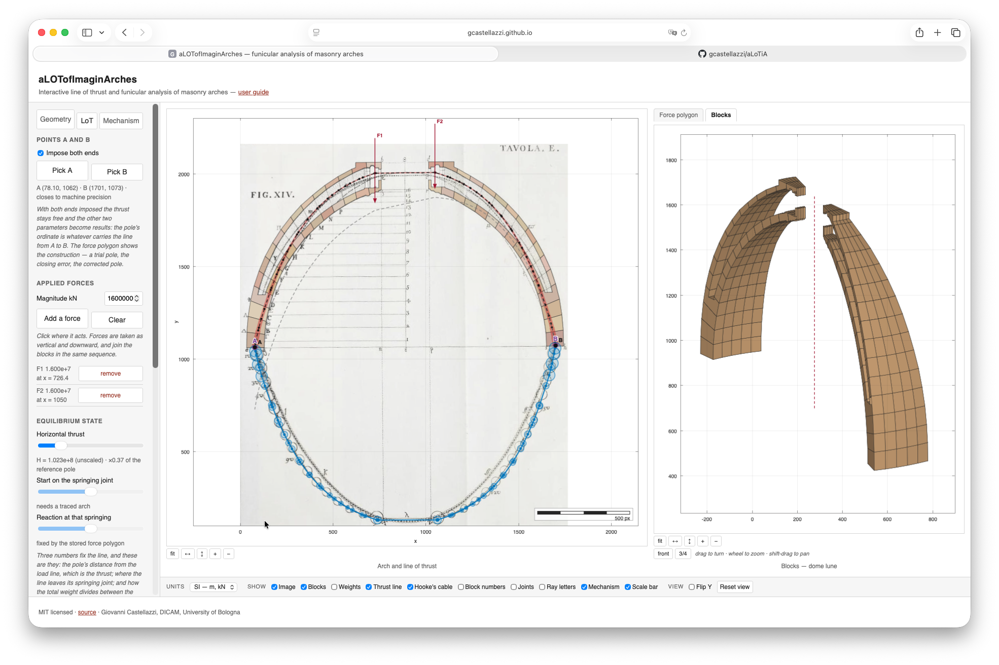

# aLOTofImaginArches

**[Open the application →](https://gcastellazzi.github.io/aLoTiA/app/)**  ·  **[User guide →](https://gcastellazzi.github.io/aLoTiA/)**

Interactive graphical statics of masonry arches, in the browser. Load a
photograph of a real arch, trace its intrados and extrados, subdivide the ring
into voussoirs, set a scale, hang loads on it, and then move the line of thrust
through its three degrees of freedom while the software checks, joint by joint,
whether it stays inside the masonry.

An arch stands not because it is in *the* state of equilibrium but because it is
in *one* of infinitely many. That multiplicity — the ∞³ of the classical
literature — is the hardest idea to convey when the subject is taught, and this
software exists so that a student can take hold of it and move it.

Written for the master's courses **MHMS** (Mechanics of Historical Masonry
Structures) and **HMWS** (Historical Masonry and Wooden Structures) at the
University of Bologna.

||
|---|

There is **nothing to install and no licence to buy**: it is a static web page,
plain ES modules with no build step and no dependencies, so the source a student
reads is exactly the source that runs.

||
|---|
|*The application, running. Poleni's plate of 1748 for the dome of St Peter's, traced into 56 voussoirs, with two loads on the haunches and Hooke's cable hanging below. Both ends of the line of thrust are pinned at A and B and the construction **closes to machine precision** — the panel on the left is where the three degrees of freedom are moved. On the right the same voussoirs turned about the axis: **a lune is broad at the springing and closes to nothing at the crown**, which is what Poleni saw in 1748 and what makes a dome not an arch.*|

## What it does

- **Trace** any image into voussoirs, with the trace checked before it is used —
  too few points, coincident curves, and crossing curves are all reported.
- **Scale and units** — one measured distance turns pixels into metres; SI,
  N–mm and kgf–cm, and **switching between them converts** rather than
  relabelling: 2 m becomes 2000 mm and the arch stands exactly as it stood.
- **Loads** placed by clicking, merged into the same sequence as the weights.
- **Three degrees of freedom**: the horizontal thrust, where the line leaves its
  springing joint, and how the total weight divides between the reactions. Both
  ends of the line are free, which is what makes the admissibility criterion
  agree with Heyman's rather than being twice as strict.
- **Admissibility**, joint by joint, with the verdict and the margin left.
- **Mechanism**: the line cannot leave the ring — where it would, it stays
  hooked at the intrados or the extrados and that point becomes a hinge. The
  arch divides into rigid macro-blocks, the degree of freedom is counted, and
  the collapse mechanism is drawn.
- **Poleni's dome**: treat the arch as a lune of a dome rather than a slice of
  a barrel, and the weights follow the width of the lune &mdash; broad at the
  major parallel, closing to nothing at the crown. The line of thrust moves
  with them.
- **Two views** of the right-hand pane: the force polygon, or the voussoirs as
  solids in three dimensions, prismatic or revolved.
- **A scale bar** on both plots, chequered like a map's, on a round 1-2-5
  value that follows the zoom. On the arch it measures a length; on the force
  polygon it measures a **force**, because every length on that drawing is one.
- **Both ends imposed**: fix where the line starts and ends, and see the
  classical trial-pole construction that gets it there &mdash; exactly, in one
  correction, not by searching.
- **Whole profiles**: trace closed outlines instead of two faces, and cut them
  into voussoirs radially. A cut through a double shell gives blocks in two
  pieces, weighed as both.
- **Bow's notation**: dashed rays lettered on the force polygon, with the same
  letter on the parallel segment of the thrust line.
- **Hooke's cable**, hung from the two springings themselves.
- **Save and reopen** a whole session as one JSON file.

### A dome is not an arch

The weight of a lune voussoir is exact, by Pappus: *V* = *A*·θ·*r̄*, with *r̄*
the distance of the block's centroid from the axis. On a semicircular ring of
16 equal blocks at a 15° slice:

| share of the total weight | barrel | dome |
|---|---|---|
| a springing block | 6.25 % | 9.75 % |
| the crown block | 6.25 % | 0.96 % |

### The mechanism, in one table

Counting the two springings as hinges throughout, *h* hinges carry *h* − 1
rigid bodies:

| interior hinges | hinges *h* | bodies *b* | 3*b* − 2*h* | state |
|---|---|---|---|---|
| 0 | 2 | 1 | −1 | once hyperstatic — the equilibrium state is not determined |
| 1 | 3 | 2 | 0 | isostatic — the three-pin arch |
| 2 | 4 | 3 | +1 | a mechanism — collapse |

Driven from the thrust, a semicircular ring reproduces the classical patterns on
its own: five hinges at minimum thrust — springings, intrados at the haunches,
extrados at the crown — and four at maximum thrust.

## Repository

| Path | What it is |
|---|---|
| `docs/app/` | the application: `js/core/` is the mechanics, `js/render/` the drawing |
| `docs/index.html` | the user guide |
| `tests/` | 180 tests, run by the Node test runner |
| `tools/serve.js` | a static server for `docs/`, in the standard library and nothing else |
| `tools/reproduce/` | the generators behind every computed figure and table of the paper, and `REPRODUCING.md` |
| `tools/setscale.js` | declares an example's real size, with the source of the dimension |

Run it locally, and run the tests:

```bash
npm start
```

```bash
npm test
```

`npm start` serves `docs/` at <http://localhost:8000/app/>; a server is needed
only because browsers refuse ES modules and `fetch()` over `file://`. No
dependencies are installed for either command — Node ≥ 18 is the only
requirement, and the application itself needs nothing but a browser.

## The examples

Twelve worked examples ship with the application, chosen to span the cases the
method has to handle: a semicircular ring, Heyman's arch and Coulomb's, a
pointed arch, a flying buttress at its two limiting thrusts, a dome section, two
natural rock arches, two bridges and a church section.

Each is a traced arch with its voussoirs, weights and background image, and most
carry a computed line of thrust as well. Four of them declare a size — a
nominal one, since the figures they are traced from are dimensionless, and each
says so on screen; the rest are shown in pixels, where the scale bar reads `px`
and the drawing claims no dimension it cannot support. **An example that states
a size must also state where that size came from**, or the application refuses
it and leaves the arch in pixels.

Not every arch admits the whole analysis, and the application says which and
why rather than inventing what it lacks. Admissibility and the mechanism need
the **joints** — the cuts between the voussoirs — and where an example is not a
single chain of abutting stones, no joints exist to be had: a dome whose two
shells interleave, a section carrying detached members, an arch with a real gap
between two blocks. Those are analysed instead through **trace a whole
profile**, which cuts an outline radially and builds proper joints, multi-piece
ones included. Nine of the twelve open the full analysis directly.

## Checking the published figures

Every computed number in the article is produced by the scripts in
[`tools/reproduce/`](tools/reproduce/REPRODUCING.md), which import the
application's own modules:

```bash
node tools/reproduce/makedata.js
```

A single point of Figure 2 can also be checked **without Node**: build the
reference ring in the *Circular ring* panel (inner radius 1, the thickness
ratio you want, 16 blocks), switch on *Drive from the thrust*, and read the
band off the Mechanism panel. See
[`REPRODUCING.md`](tools/reproduce/REPRODUCING.md) for the comparison.

## Licence and citation

MIT. Developed by Giovanni Castellazzi, DICAM, University of Bologna.

Machine-readable metadata is in [`CITATION.cff`](CITATION.cff) and
[`codemeta.json`](codemeta.json); GitHub renders the first as a *Cite this
repository* button. Changes are recorded in [`CHANGELOG.md`](CHANGELOG.md), and
[`CONTRIBUTING.md`](CONTRIBUTING.md) says how to run and test the project.

### Code metadata

| Nr. | Code metadata description | |
|---|---|---|
| C1 | Current code version | 1.1.0 |
| C2 | Permanent link to code/repository used for this code version | <https://github.com/gcastellazzi/aLoTiA> |
| C3 | Permanent link to reproducible capsule | the application itself is the capsule: <https://gcastellazzi.github.io/aLoTiA/app/> runs in the browser with nothing installed |
| C4 | Legal code license | MIT |
| C5 | Code versioning system used | git |
| C6 | Software code languages, tools and services used | JavaScript (ES2022 modules), HTML, CSS; Node.js for the tests and the figure generators; GitHub Pages, GitHub Actions |
| C7 | Compilation requirements, operating environments, dependencies | **none**: no build step and no dependencies. Any modern browser runs the application; Node ≥ 18 runs the tests and the figure generators |
| C8 | Link to developer documentation | <https://gcastellazzi.github.io/aLoTiA/> and [`docs/app/js/core/README.md`](docs/app/js/core/README.md) |
| C9 | Support email for questions | <giovanni.castellazzi@unibo.it> |

*Ut pendet continuum flexile, sic stabit contiguum rigidum inversum.*
