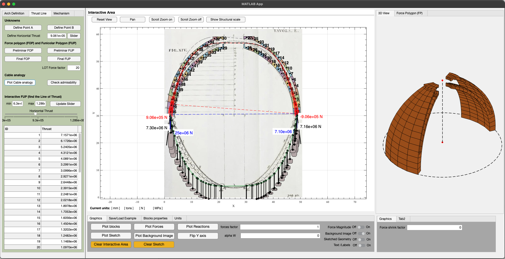

# aLOTofImaginArches

**[Open the application →](https://gcastellazzi.github.io/aLoTiA/app/)**  ·  **[User guide →](https://gcastellazzi.github.io/aLoTiA/)**

Interactive graphical statics of masonry arches, in the browser. Load a
photograph of a real arch, trace its intrados and extrados, subdivide the ring
into voussoirs, set a scale, hang loads on it, and then move the line of thrust
through its three degrees of freedom while the software checks, joint by joint,
whether it stays inside the masonry.

An arch stands not because it is in *the* state of equilibrium but because it is
in *one* of infinitely many. That multiplicity — the ∞³ of the classical
literature — is the hardest idea to convey when the subject is taught, and this
software exists so that a student can take hold of it and move it.

Written for the master's courses **MHMS** (Mechanics of Historical Masonry
Structures) and **HMWS** (Historical Masonry and Wooden Structures) at the
University of Bologna.

||
|---|

There is **nothing to install and no licence to buy**: it is a static web page,
plain ES modules with no build step and no dependencies, so the source a student
reads is exactly the source that runs.

||
|---|

## What it does

- **Trace** any image into voussoirs, with the trace checked before it is used —
  too few points, coincident curves, and crossing curves are all reported.
- **Scale and units** — one measured distance turns pixels into metres; SI,
  N–mm and kgf–cm.
- **Loads** placed by clicking, merged into the same sequence as the weights.
- **Three degrees of freedom**: the horizontal thrust, where the line leaves its
  springing joint, and how the total weight divides between the reactions. Both
  ends of the line are free, which is what makes the admissibility criterion
  agree with Heyman's rather than being twice as strict.
- **Admissibility**, joint by joint, with the verdict and the margin left.
- **Mechanism**: the line cannot leave the ring — where it would, it stays
  hooked at the intrados or the extrados and that point becomes a hinge. The
  arch divides into rigid macro-blocks, the degree of freedom is counted, and
  the collapse mechanism is drawn.
- **Poleni's dome**: treat the arch as a lune of a dome rather than a slice of
  a barrel, and the weights follow the width of the lune &mdash; broad at the
  major parallel, closing to nothing at the crown. The line of thrust moves
  with them.
- **Two views** of the right-hand pane: the force polygon, or the voussoirs as
  solids in three dimensions, prismatic or revolved.
- **Both ends imposed**: fix where the line starts and ends, and see the
  classical trial-pole construction that gets it there &mdash; exactly, in one
  correction, not by searching.
- **Whole profiles**: trace closed outlines instead of two faces, and cut them
  into voussoirs radially. A cut through a double shell gives blocks in two
  pieces, weighed as both.
- **Bow's notation**: dashed rays lettered on the force polygon, with the same
  letter on the parallel segment of the thrust line.
- **Hooke's cable**, hung from the two springings themselves.
- **Save and reopen** a whole session as one JSON file.

### A dome is not an arch

The weight of a lune voussoir is exact, by Pappus: *V* = *A*·θ·*r̄*, with *r̄*
the distance of the block's centroid from the axis. On a semicircular ring of
16 equal blocks at a 15° slice:

| share of the total weight | barrel | dome |
|---|---|---|
| a springing block | 6.25 % | 9.75 % |
| the crown block | 6.25 % | 0.96 % |

### The mechanism, in one table

Counting the two springings as hinges throughout, *h* hinges carry *h* − 1
rigid bodies:

| interior hinges | hinges *h* | bodies *b* | 3*b* − 2*h* | state |
|---|---|---|---|---|
| 0 | 2 | 1 | −1 | once hyperstatic — the equilibrium state is not determined |
| 1 | 3 | 2 | 0 | isostatic — the three-pin arch |
| 2 | 4 | 3 | +1 | a mechanism — collapse |

Driven from the thrust, a semicircular ring reproduces the classical patterns on
its own: five hinges at minimum thrust — springings, intrados at the haunches,
extrados at the crown — and four at maximum thrust.

## Repository

| Path | What it is |
|---|---|
| `docs/app/` | the application: `js/core/` is the mechanics, `js/render/` the drawing |
| `docs/index.html` | the user guide |
| `tests/` | 160 tests, run by the Node test runner |
| `tools/serve.js` | a static server for `docs/`, in the standard library and nothing else |
| `tools/reproduce/` | the generators behind every computed figure and table of the paper, and `REPRODUCING.md` |

Run it locally, and run the tests:

```bash
npm start
```

```bash
npm test
```

`npm start` serves `docs/` at <http://localhost:8000/app/>; a server is needed
only because browsers refuse ES modules and `fetch()` over `file://`. No
dependencies are installed for either command — Node ≥ 18 is the only
requirement, and the application itself needs nothing but a browser.

## The examples, audited

**Twelve examples ship with this repository** — the ones the SoftwareX article
discusses. The full corpus of twenty-eight converted files is in the
[development repository](https://github.com/gcastellazzi/aLOTofImaginArches);
the twelve here were chosen to cover every case the article names.

Because the port was checked against the MATLAB original rather than
reimplemented from a description, it produced a usable audit of them:

| | |
|---|---|
| **8** carry a complete solution | recomputed from their geometry alone, agreeing with what MATLAB saved to **machine precision** — worst relative error 8.5 × 10⁻¹⁶ on the force polygon and 3.9 × 10⁻¹⁵ on the thrust line |
| **3** were saved before a solution was computed | Utah Arch, Nervi, Pippard–Ashby |
| **1** is internally inconsistent | San Francesco: loads were applied but never written to the file, so the stored solution does not correspond to the stored geometry. Detected and reported rather than silently drawn |

### The joints were never stored, and are recovered

The `.mat` files hold the voussoirs but never held the **cuts between them**,
and a joint is the one thing admissibility and the mechanism analysis are asked
about. Without them the panel could only answer *"available for a traced arch,
which has joints"*, and the whole of the Mechanism tab was reachable only by
tracing a photograph from scratch.

They are not lost, though: a joint is the face along which two voussoirs abut,
and `core/joints.js` recovers it from the polygons — every vertex of either
block that lies on the boundary of the other is a point of that face, and the
joint is the segment between the two furthest apart. That is the same
convention the profile cutter already uses, where a cut through a double shell
runs from the first material entered to the last left.

**Nine of the twelve open the whole analysis.** The other three are refused
with a reason on screen rather than given invented cuts: the Poleni dome
interleaves its two shells, having had its two-piece blocks flattened into one
polygon each; San Francesco carries detached members; the Utah arch has a real
gap between two blocks. All three remain analysable through **trace a whole
profile**, which cuts the outline radially and builds proper joints,
multi-piece ones included.

## Checking the published figures

Every computed number in the article is produced by the scripts in
[`tools/reproduce/`](tools/reproduce/REPRODUCING.md), which import the
application's own modules:

```bash
node tools/reproduce/makedata.js
```

A single point of Figure 2 can also be checked **without Node**: build the
reference ring in the *Circular ring* panel (inner radius 1, the thickness
ratio you want, 16 blocks), switch on *Drive from the thrust*, and read the
band off the Mechanism panel. See
[`REPRODUCING.md`](tools/reproduce/REPRODUCING.md) for the comparison.

## Latest developments

- **The joints of a stored example are recovered from its voussoirs**, so
  admissibility, the hinges and the collapse mechanism work on the shipped
  examples and not only on a freshly traced arch. Where the blocks are not a
  chain the recovery refuses and says which example and why.
- **The six examples saved without a solution are analysable.** Nothing was
  missing from them but a pole, which the mechanism search computes for itself;
  the consistency check had been treating "no stored solution" like "a stored
  solution that does not match its geometry".
- **A narrow admissible band is no longer missed.** The collapse search seeded
  on the first admissible sample of a grid, which is a boolean test on a grid:
  `Ctesifonte_01` stands only between *H*/*W* = 0.041 and 0.061, the grid
  sampled 0.0397 and 0.0593, and a real arch came back as standing at no thrust
  at all. The seed now follows the maximum of the clearance.
- **A three-tab panel** (Geometry, LoT, Mechanism), per-plot view tools, and a
  3-D block view that turns under the mouse.
- **Poleni's dome and a 3-D block view**, with the second pane tabbed between
  the force polygon and the solids, as the MATLAB version had it.
- **Mechanism analysis**: hinge formation from the thrust line, macro-blocks,
  the degree-of-freedom count, and the collapse kinematics drawn by integrating
  the velocity field so that the blocks stay rigid and the hinges stay shut.
- **Both ends of the thrust line freed.** Pinning them at the joint mid-points
  had discarded two of the three degrees of freedom: a semicircular ring needed
  *t*/*r*ᵢ ≈ 0.198 before any line fitted, against Heyman's 0.108. With the ends
  free the same ring manages 0.115, and the limit line comes out running through
  the extrados at both springings.
- **Bow's notation** on the force polygon and the thrust line together.
- **Save and reopen**, with the file validated before it is trusted.
- **Scale, units and applied loads** for traced arches.
- A **SoftwareX manuscript** describing the software, kept separately
  until it is published.

## Where the rest of it is

**This repository is the web application and nothing else** — the software the
SoftwareX article describes, with the twelve examples it discusses. Deliberately
absent, so that what is published is what is documented:

| | |
|---|---|
| the MATLAB App Designer original, `aLOTofImaginArches.mlapp`, frozen since 2025 | development repository |
| `external_functions/`, its MATLAB dependencies | development repository |
| the full corpus of twenty-eight converted examples and the `.mat` originals | development repository |
| `tools/mat2json.py`, the converter, and its `--check` mode | development repository |
| the three click-by-click PDF tutorials for the MATLAB version | development repository |

All of it is at
[github.com/gcastellazzi/aLOTofImaginArches](https://github.com/gcastellazzi/aLOTofImaginArches),
which remains where the work happens. Two differences from the MATLAB tutorials
are worth knowing if you read them: the ends of the thrust line are free here,
and the unit weight is entered as a **weight** density rather than a mass
density.

**pyLOT**, a cross-platform desktop port reading the same `.mat` files, is
likewise frozen: [github.com/gcastellazzi/pyLOT](https://github.com/gcastellazzi/pyLOT).

## Future developments

- Arches on spreading supports
- Sliding failure, which Heyman's third assumption sets aside
- Fiber-reinforced enhancement

## Licence and citation

MIT. Developed by Giovanni Castellazzi, DICAM, University of Bologna.

Machine-readable metadata is in [`CITATION.cff`](CITATION.cff) and
[`codemeta.json`](codemeta.json); GitHub renders the first as a *Cite this
repository* button. Changes are recorded in [`CHANGELOG.md`](CHANGELOG.md), and
[`CONTRIBUTING.md`](CONTRIBUTING.md) says how to run and test the project.

### Code metadata

| Nr. | Code metadata description | |
|---|---|---|
| C1 | Current code version | 1.1.0 |
| C2 | Permanent link to code/repository used for this code version | <https://github.com/gcastellazzi/aLoTiA> |
| C3 | Permanent link to reproducible capsule | the application itself is the capsule: <https://gcastellazzi.github.io/aLoTiA/app/> runs in the browser with nothing installed |
| C4 | Legal code license | MIT |
| C5 | Code versioning system used | git |
| C6 | Software code languages, tools and services used | JavaScript (ES2022 modules), HTML, CSS; Node.js for the tests; Python 3 for `tools/mat2json.py`; GitHub Pages, GitHub Actions |
| C7 | Compilation requirements, operating environments, dependencies | **none**: no build step and no dependencies. Any modern browser runs the application; Node ≥ 18 runs the tests |
| C8 | Link to developer documentation | <https://gcastellazzi.github.io/aLoTiA/> and [`docs/app/js/core/README.md`](docs/app/js/core/README.md) |
| C9 | Support email for questions | <giovanni.castellazzi@unibo.it> |

*Ut pendet continuum flexile, sic stabit contiguum rigidum inversum.*
